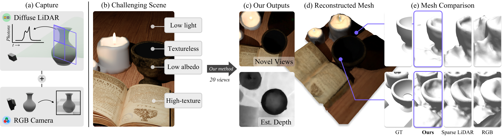

# Blurred LiDAR for Sharper 3D



3D surface reconstruction is essential across applications of virtual reality, robotics, and mobile scanning. However, RGB-based reconstruction often fails in low-texture, low-light, and low-albedo scenes. Handheld LiDARs, now common on mobile devices, aim to address these challenges by capturing depth information from time-of-flight measurements of a coarse grid of projected dots. Yet, these sparse LiDARs struggle with scene coverage on limited input views, leaving large gaps in depth information. 

In this work, we propose using an alternative class of "blurred" LiDAR that emits a diffuse flash, greatly improving scene coverage but introducing spatial ambiguity from mixed time-of-flight measurements across a wide field of view. To handle these ambiguities, we propose leveraging the complementary strengths of diffuse LiDAR with RGB. We introduce a Gaussian surfel-based rendering framework with a scene-adaptive loss function that dynamically balances RGB and diffuse LiDAR signals. We demonstrate that, surprisingly, diffuse LiDAR can outperform traditional sparse LiDAR, enabling robust 3D scanning with accurate color and geometry estimation in challenging environments.

---
<br />

## 🌳 Environment Setup

### Clone the Repository
```bash
git clone https://github.com/NikhilBehari/bls3d.git
cd bls3d
```

### Create the Conda Environment
```bash
conda env create --file bls3d_env.yml
conda activate bls3d
```

### Compile and Install our CUDA Rasterizer
Our modified CUDA rasterizer enables gradient-based optimization using transient loss functions. To recompile and install it:
```bash
cd submodules/diff-gaussian-rasterization
python setup.py install && pip install .
```

---
<br />

## 🏃 Training

### Train a Model
To train on a dataset, use the `train.py` script:
```bash
python train.py -s ./datasets/folder $(cat param_files/params.txt)
```

Sample parameter files for our texture and lighting variation experiments are provided in the `param_files` directory:
- `light_variation.txt`
- `texture_variation.txt`

These parameter files can be modified to fine-tune training for specific datasets.

---

<br />

## 🎨 Rendering

### Generate Images and Reconstruct Mesh
Once training is complete, the trained model will be saved in the `output/` directory. Use the `render.py` script to render images and reconstruct meshes:
```bash
python render.py -m path/to/your/trained/model --img --depth 10
```

---