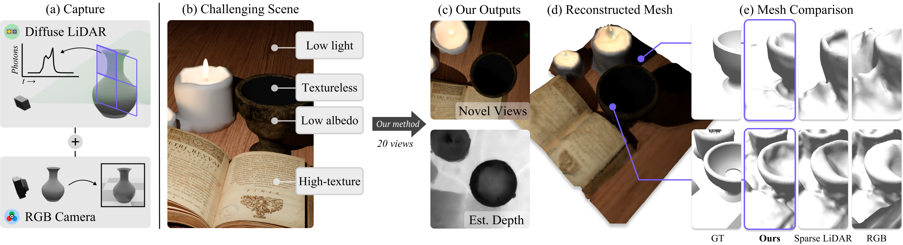

# Blurred LiDAR for Sharper 3D: Robust Handheld 3D Scanning with Diffuse LiDAR and RGB

<p align="center">
  
</p>

<p align="center">
  <a href="https://nikhilbehari.github.io/bls3d/"><b>Project page</b></a>
  &nbsp;·&nbsp;
  <a href="https://arxiv.org/abs/2411.19474"><b>Paper</b></a>
</p>

> Behari, N., Young, A., Somasundaram, S., Klinghoffer, T., Dave, A., & Raskar, R.
> *Blurred LiDAR for Sharper 3D: Robust Handheld 3D Scanning with Diffuse LiDAR and RGB.*
> CVPR 2025 (Highlight).

3D surface reconstruction is essential across applications of virtual reality, robotics, and mobile scanning. However, RGB-based reconstruction often fails in low-texture, low-light, and low-albedo scenes. Handheld LiDARs, now common on mobile devices, aim to address these challenges by capturing depth information from time-of-flight measurements of a coarse grid of projected dots. Yet, these sparse LiDARs struggle with scene coverage on limited input views, leaving large gaps in depth information.

In this work, we propose using an alternative class of "blurred" LiDAR that emits a diffuse flash, greatly improving scene coverage but introducing spatial ambiguity from mixed time-of-flight measurements across a wide field of view. To handle these ambiguities, we propose leveraging the complementary strengths of diffuse LiDAR with RGB. We introduce a Gaussian surfel-based rendering framework with a scene-adaptive loss function that dynamically balances RGB and diffuse LiDAR signals. We demonstrate that, surprisingly, diffuse LiDAR can outperform traditional sparse LiDAR, enabling robust 3D scanning with accurate color and geometry estimation in challenging environments.

---
<br />

## 🌳 Environment Setup

```bash
git clone https://github.com/NikhilBehari/bls3d.git
cd bls3d
bash setup_env.sh
conda activate bls3d
```

`setup_env.sh` builds a fresh `bls3d` conda env with Python 3.10, PyTorch 2.1
on CUDA 11.8, gcc-11, our modified CUDA rasterizer, simple-knn, and pytorch3d.
A NVIDIA GPU with the proprietary driver is required.

---
<br />

## 🏃 Training

```bash
python train.py -s path/to/dataset -m my_model $(cat param_files/texture_variation.txt)
```

Outputs are written to `output/<my_model>/`. Two sample parameter files are
provided in [`param_files/`](param_files/):

- [`texture_variation.txt`](param_files/texture_variation.txt)
- [`light_variation.txt`](param_files/light_variation.txt)

---
<br />

## 🎨 Rendering

```bash
python render.py -m output/my_model --img --depth 10
```

Renders the test views, computes PSNR, and (when `--skip_train` is omitted)
runs a Poisson surface reconstruction at the given depth. Outputs are written
to `output/my_model/test/ours_<iter>/` and `output/my_model/poisson_mesh_<depth>.ply`.

---

## Citation

```bibtex
@inproceedings{behari2025blurred,
  title     = {Blurred LiDAR for Sharper 3D: Robust Handheld 3D Scanning with Diffuse LiDAR and RGB},
  author    = {Behari, Nikhil and Young, Aaron and Somasundaram, Siddharth and Klinghoffer, Tzofi and Dave, Akshat and Raskar, Ramesh},
  booktitle = {Proceedings of the IEEE/CVF Conference on Computer Vision and Pattern Recognition (CVPR)},
  year      = {2025},
}
```